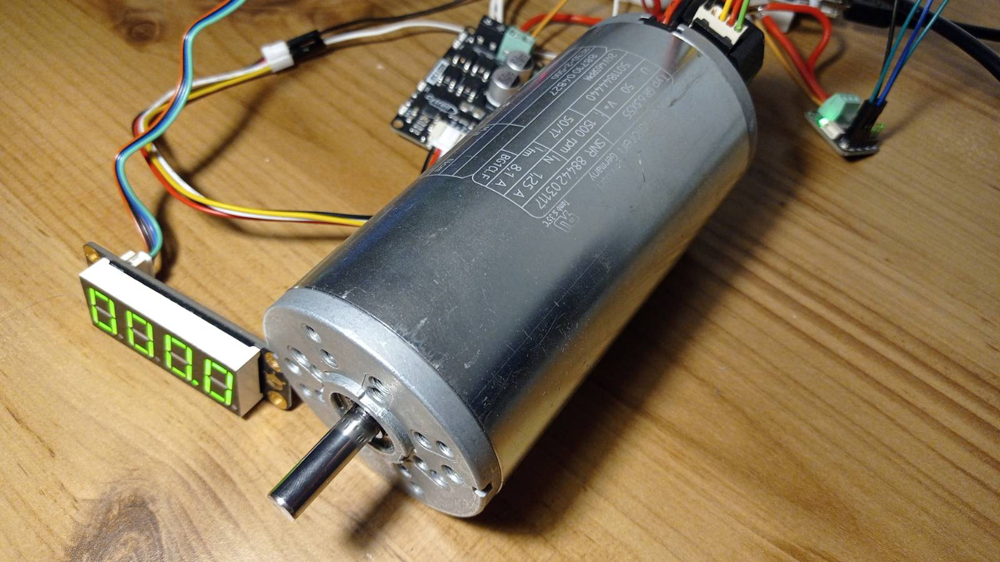
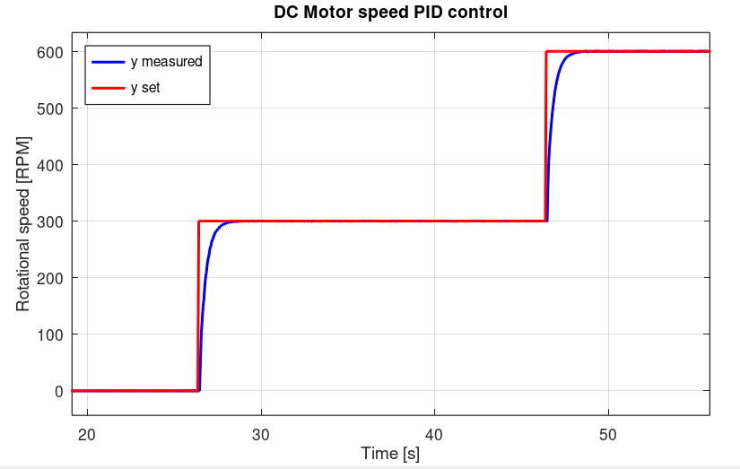
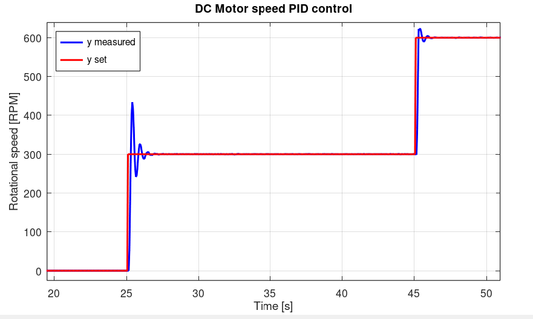

# STM32_Embedded_Control_Systems
Embedded control systems library for STM32 microcontrollers. Provides modular discrete-time PID controllers, actuator drivers, and real-time examples built on STM32 using HAL and FreeRTOS

Library consist of:

- PWM output functions

They calculate and set given PWM duty cycle to a timer

    How to use:
    - Configure timer for PWM output
    - Specify channel and PWM duty cycle in percent value [0.0 , 100.0 ] %

        The function header is below;
        void PWM_set_output(float U_percent, TIM_HandleTypeDef *htim,uint32_t channel)

- PID controller 

    Features:
    - Output saturation (min, max values)
    - Anti-windup "clamping" method (optional)
    - Adjustable parameters: Kp, Ti and Td value

Demo:
PID controller was tested on STM32L476RG Nucleo board and industrial-grade GR63x55 DC Motor.

   
  <em>Figure 1. DC Motor test setup</em>

   
  <em>Figure 2. PID response for Kp = 0.04, Ti = 2.5</em>

   
  <em>Figure 3. PID response for Kp = 0.04, Ti = 0.7</em>

